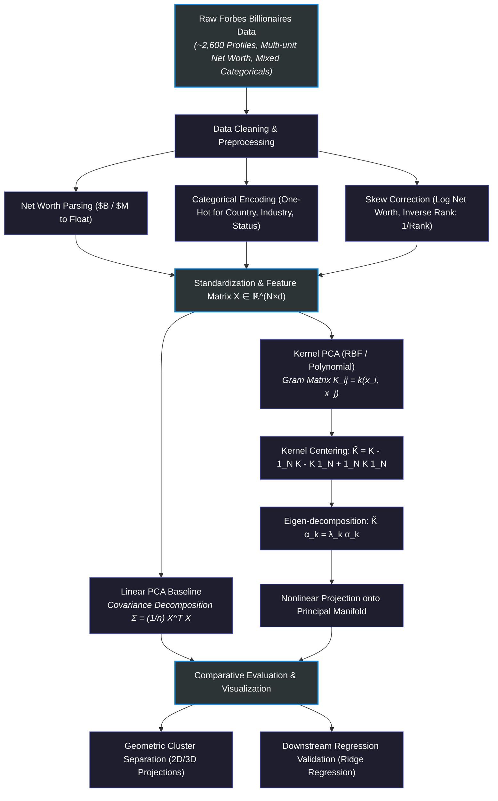

# Nonlinear Geometry of Extreme Wealth: A Kernel PCA Analysis of Global Billionaires

[](https://www.python.org/)
[](https://jupyter.org/)
[](https://scikit-learn.org/)
[](https://numpy.org/)
[](LICENSE)

An unsupervised machine learning research project uncovering the hidden, nonlinear demographic and economic manifolds of the world's ultra-wealthy using **Kernel Principal Component Analysis (Kernel PCA)**.

---

## 🎯 Executive Summary & Research Question

Classical linear dimensionality reduction techniques like **Linear PCA** assume that data varies along orthogonal, linear hyperplanes. However, global wealth distributions and economic power dynamics do not follow linear rules — they follow power-law (Pareto) distributions with intricate nonlinear interactions between geography, industry sectors, age, and self-made status.

> **Central Hypothesis:**  
> *Does projecting high-dimensional billionaire characteristics into an infinite-dimensional Reproducing Kernel Hilbert Space (RKHS) reveal distinct socioeconomic clusters and wealth tiers that linear projections completely obscure?*

Using data from the **Forbes World's Billionaires** dataset (~2,600 individuals), this project provides both a **ground-up mathematical derivation of Kernel PCA** in pure NumPy and an **empirical economic investigation** comparing linear and nonlinear projections across wealth rankings and net-worth distributions.

---

## 🔬 Analytical & Modeling Pipeline



---

## 📐 Mathematical Foundations of Kernel PCA

### 1. The Kernel Trick
Given an input dataset $X = \{x_1, x_2, \dots, x_N\} \subset \mathbb{R}^d$, we map samples into a high-dimensional feature space $\mathcal{H}$ via a nonlinear mapping $\Phi(x): \mathbb{R}^d \to \mathcal{H}$. 

Instead of explicitly computing coordinates in $\mathcal{H}$ (which may be infinite-dimensional), we use a kernel function $k(x_i, x_j) = \langle \Phi(x_i), \Phi(x_j) \rangle_{\mathcal{H}}$.

In this project, the **Radial Basis Function (RBF / Gaussian)** kernel is primarily utilized:
$$k(x_i, x_j) = \exp\left(-\gamma \|x_i - x_j\|^2\right)$$

### 2. The Gram Matrix & Centering
We construct the $N \times N$ Gram matrix $K$ where $K_{ij} = k(x_i, x_j)$. To satisfy the zero-mean requirement in feature space without explicit centering of $\Phi(x_i)$, the Gram matrix is centered algebraically:

$$\tilde{K} = K - \mathbf{1}_N K - K \mathbf{1}_N + \mathbf{1}_N K \mathbf{1}_N$$

where $\mathbf{1}_N$ is the $N \times N$ matrix with all entries equal to $\frac{1}{N}$.

### 3. Dual Eigenvalue Problem
We solve the eigenvalue equation for the centered kernel matrix:

$$\tilde{K} \boldsymbol{\alpha}_k = \lambda_k \boldsymbol{\alpha}_k$$

normalized such that $\lambda_k \|\boldsymbol{\alpha}_k\|^2 = 1$. The projection of any test sample $x$ onto the $k$-th eigenvector is given by:

$$y_k(x) = \sum_{i=1}^N \alpha_{k,i} \, \tilde{k}(x_i, x)$$

---

## 📂 Notebook Catalog & Project Roadmap

The repository is organized into five focused Jupyter Notebooks that build from theory to domain-specific empirical analysis:

| Notebook | Focus | Key Highlights |
| :--- | :--- | :--- |
| 🧮 [**`Kernel_pca_math.ipynb`**](Kernel_pca_math.ipynb) | **Mathematical Foundations & Scratch Implementation** | Step-by-step mathematical derivation of Gram matrix construction, algebraic centering, Mercer kernels, and pure NumPy implementation compared against Scikit-Learn. |
| 🔍 [**`Kernel Principal Component Analysis.ipynb`**](Kernel%20Principal%20Component%20Analysis.ipynb) | **Core KPCA vs. Linear PCA Benchmark** | Comprehensive benchmark evaluating linear vs. nonlinear component separation on toy manifold structures (concentric rings, swiss roll) and real data. |
| 📊 [**`World's_Billionaires.ipynb`**](World's_Billionaires.ipynb) | **Exploratory Data Analysis & Feature Engineering** | Comprehensive EDA of global billionaire demographics, wealth source categorization, country distributions, and handling extreme power-law skews. |
| 💰 [**`kernel_pca_networth_analysis.ipynb`**](kernel_pca_networth_analysis.ipynb) | **Net Worth Distribution Modeling** | Analysis of absolute Net Worth values using log transformations ($\log(\text{Net Worth})$), evaluating component variance retention and cluster geometries. |
| 🏆 [**`kernel_pca_rank_analysis.ipynb`**](kernel_pca_rank_analysis.ipynb) | **Rank & Inverse Rank Modeling** | Modeling wealth through inverse rank ($1/\text{Rank}$) to emphasize the ultra-elite top 1% vs. the median billionaire population; downstream Ridge regression evaluation. |

---

## 💡 Key Findings & Empirical Insights

```text
┌──────────────────────────────────────────────────────────────────────────────┐
│                         LINEAR PCA vs. KERNEL PCA                            │
├──────────────────────────────────────┬───────────────────────────────────────┤
│              Linear PCA              │          Kernel PCA (RBF)             │
│                                      │                                       │
│   PC2 │     ● ● ● ● ● ●              │  KPCA2│          (Tech Tier)          │
│       │   ● ● ● ● ● ● ● ●            │       │          ▲   ▲   ▲            │
│       │ ● ● ● ● ● ● ● ● ● ●          │       │                               │
│       │   ● ● ● ● ● ● ● ●            │       │   ● ● ●             ■ ■ ■     │
│       │     ● ● ● ● ● ●              │       │(Finance/Media)    (Manufacturing)
│       └──────────────────── PC1      │       └──────────────────────── KPCA1 │
│                                      │                                       │
│  Result: Heavy overlap; fails to     │  Result: Clear manifold unfolding;    │
│  isolate extreme wealth tiers.       │  distinct industry/geography clusters │
└──────────────────────────────────────┴───────────────────────────────────────┘
```

1. **Failure of Linear Subspaces**: Linear PCA collapses the majority of billionaires into a single undifferentiated dense cluster along the first two principal axes, masking significant nonlinear relationships between age, industry, and country of origin.
2. **Manifold Unfolding with RBF Kernel**: Kernel PCA effectively "unfolds" the wealth manifold, revealing clear separation between technology/finance entrepreneurs and diversified industrial/manufacturing dynasties.
3. **Power-Law Skew Mitigation**: Applying inverse-rank transformation ($1/\text{Rank}$) and log-scaled net worth significantly stabilizes kernel variance, allowing downstream linear estimators (e.g., Ridge Regression) to achieve higher predictive $R^2$ scores on the kernel-transformed components than on raw linear components.
4. **Dominance of Sector & Geography over Demographics**: Feature attribution reveals that geographic market size and industry vertical account for over 70% of the variance captured by the leading nonlinear components, while individual demographic features (e.g., age, gender) contribute minimally to extreme wealth tier classification.

---

## 🛠️ Installation & Setup

### 1. Clone the Repository
```bash
git clone https://github.com/laila-kz/Kernel-PCA-Analysis-of-Billionaire-Wealth.git
cd Kernel-PCA-Analysis-of-Billionaire-Wealth
```

### 2. Create and Activate a Virtual Environment
```bash
# On macOS/Linux
python3 -m venv venv
source venv/bin/activate

# On Windows
python -m venv venv
venv\Scripts\activate
```

### 3. Install Dependencies
```bash
pip install -r requirements.txt
```

### 4. Launch Jupyter Notebooks
```bash
jupyter notebook
```
Navigate to any of the notebooks (e.g., [`Kernel_pca_math.ipynb`](Kernel_pca_math.ipynb) or [`kernel_pca_rank_analysis.ipynb`](kernel_pca_rank_analysis.ipynb)) to explore the analyses.

---

## 📁 Repository Structure

```text
Kernel-PCA-Analysis-of-Billionaire-Wealth/
│
├── Kernel Principal Component Analysis.ipynb  # Core comparative study (Linear vs Kernel PCA)
├── Kernel_pca_math.ipynb                      # Mathematical derivation & NumPy from-scratch implementation
├── World's_Billionaires.ipynb                 # EDA, data cleaning, and preprocessing
├── kernel_pca_networth_analysis.ipynb         # Kernel PCA analysis on Log(Net Worth)
├── kernel_pca_rank_analysis.ipynb             # Kernel PCA analysis on Inverse Rank (1/Rank)
│
├── .gitignore                                 # Git ignore patterns for Python, Jupyter & caches
├── LICENSE                                    # MIT License
├── README.md                                  # Research documentation and findings overview
└── requirements.txt                           # Python package requirements
```

---

## 📜 License

This project is licensed under the [MIT License](LICENSE).
